# Grok30m

[](LICENSE) [](https://cursor.com) [](https://code.visualstudio.com)

**Grok30m** is a fork of [Grok Build for VS Code (Community)](https://github.com/phuryn/grok-build-vscode). It tracks community **4.5.2** and adds a Claude Code–style workflow: editor-tab chat, a dedicated Sessions sidebar, and filters for automated agent sessions.

> **Not affiliated with or endorsed by xAI or Paweł Huryn.** *Grok*, *Grok Build*, and *xAI* are trademarks of xAI.

A daily GitHub Action (`.github/workflows/sync-community.yml`) checks community **releases** (a few seconds, no `npm ci`). Only when a new tag exists does it merge, reapply session tabs, and publish a vsix to [GitHub Releases](https://github.com/thirtym/grok30m/releases/latest). Installed copies pick that up via **Grok30m: Check for Updates** / `grok.autoUpdate`. If a merge would drop the tabs, tests fail and an issue is opened — nothing is published.

Manual equivalent: `npm run compile && node scripts/sync-community.mjs --plan` (or `--apply`).

Two ways to use the same agent UI on top of the **Grok Build CLI**:

| | **VS Code extension** | **Grok Build Desktop** |
|---|---|---|
| **What** | Sidebar chat inside VS Code / Cursor | Standalone Electron app (no editor required) |
| **Get it** | [VS Code Marketplace](https://marketplace.visualstudio.com/items?itemName=PawelHuryn.grok-vscode-phuryn) · [Open VSX](https://open-vsx.org/extension/PawelHuryn/grok-vscode-phuryn) | [afkpilot.com/desktop](https://afkpilot.com/desktop) (see [Desktop install](#grok-build-desktop)) |
| **Best when** | You already live in the editor | You want the agent as its own window |

Both speak JSON-RPC to `grok agent stdio` (and to other ACP agents — **Codex** and **Claude Code** included), share chat history under `~/.grok`, and support **Remote Control** via **[AFK Pilot](https://afkpilot.com)** — pair once and watch, approve, and steer from your phone or any browser. Drop files in as `@`-context, run **multiple sessions**, generate **images & video inline**, and dictate by **voice**.

No manual setup on either host: onboarding **walks you through installing the `grok` CLI and signing in** — with a **SuperGrok or X Premium+ subscription**, or an **xAI API key**.

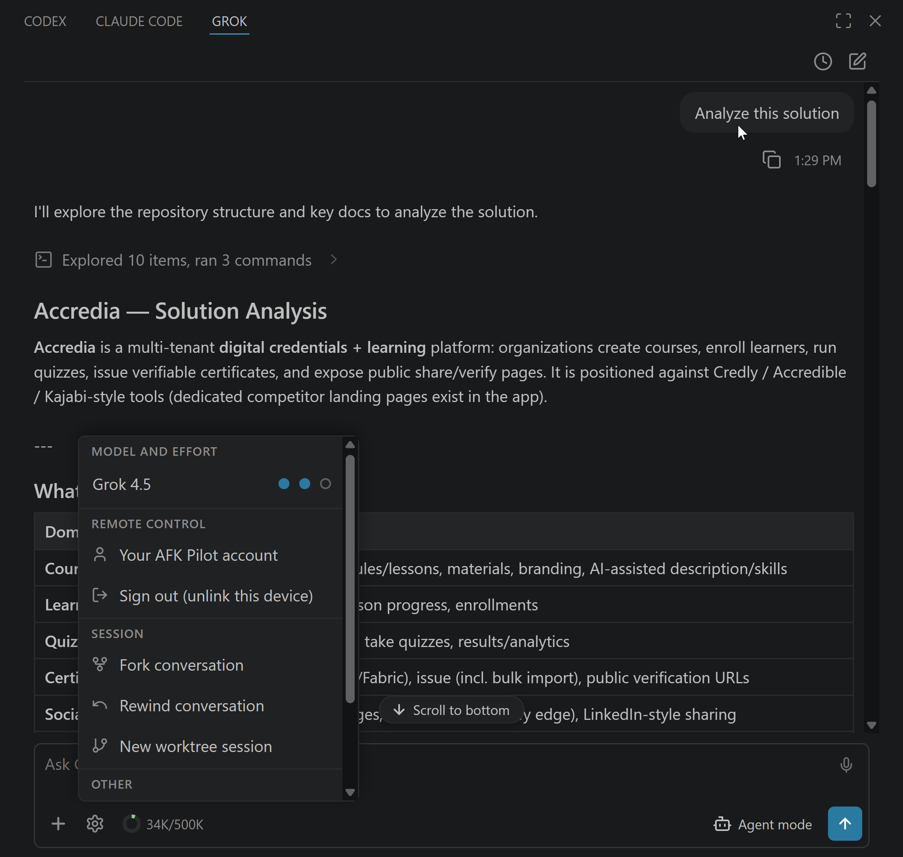

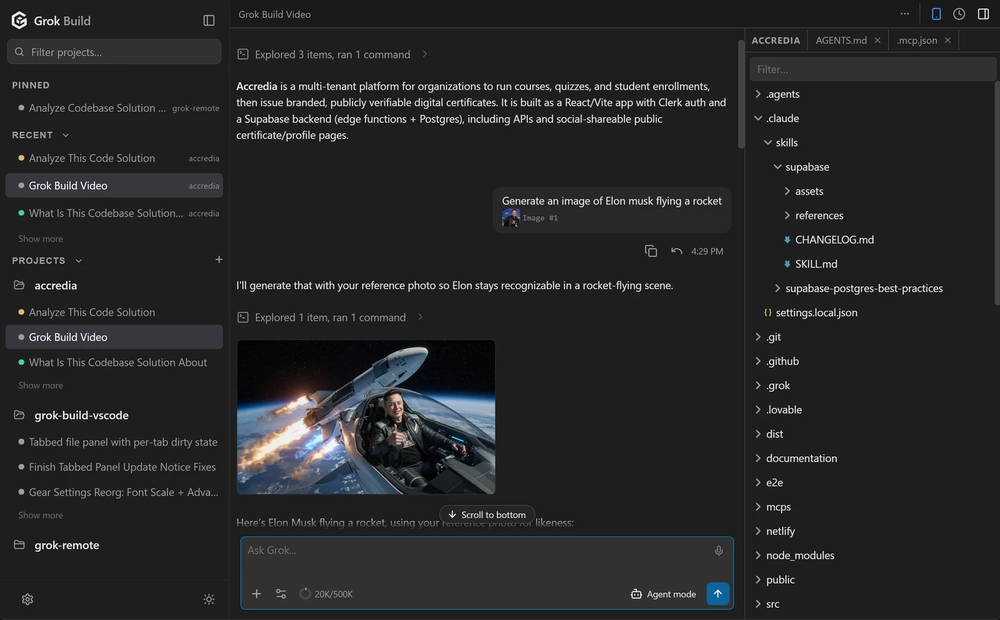

---

## Why use this?

If you live in your editor **or** want a dedicated agent window, this puts Grok Build in a graphical workflow on top of the CLI: **diff preview** on every proposed edit, **open files and selection as context**, **parallel sessions** with status dots, **resumable history**, **inline images & video**, and **voice dictation**. The CLI does the heavy lifting; these hosts are the GUI for when you'd rather not be in a terminal.

### Features & capabilities

_Click any feature to expand._

<details>
<summary><strong>Permission cards with diff preview</strong> — see every edit in VS Code's native diff before you approve</summary>

When Grok proposes an edit, hit **open diff →** to review the whole file in VS Code's native diff editor, focused on the first changed line, then *Allow once / always* or *Reject*. The file is written only **after** you approve.

A card for a **command** offers a third answer: **Yes, and allow `npm` this session**, naming the program it would allow — grant `npm` once and `npm test`, `npm run build` and `npm ci` stop asking for the rest of the conversation. The grant is deliberately narrow: it lasts the conversation and is gone when it ends, a chained command is judged one segment at a time (so `npm test && rm -rf build` does not ride in on an `npm` grant), a command we cannot take apart with confidence still asks, and nothing is auto-approved at all while you are in Plan mode. Every command allowed this way still appears in the transcript as an answered card. For a grant that outlives the conversation, the agent's own `[permission]` rules in `.grok/config.toml` take glob patterns.


</details>

<details>
<summary><strong>Modes — Agent, Plan & Auto accept</strong></summary>

Switch from the bottom toolbar — even mid-turn, so you can flip to **Auto accept** to stop approving cards without stopping Grok. **Plan** is enforced by the *extension*, not the CLI — workspace writes and non-read-only commands are genuinely blocked until you approve the plan (see [How it works](#how-it-works)). **Auto accept** approves actions automatically; approving a plan returns you to whichever mode you were in before planning.

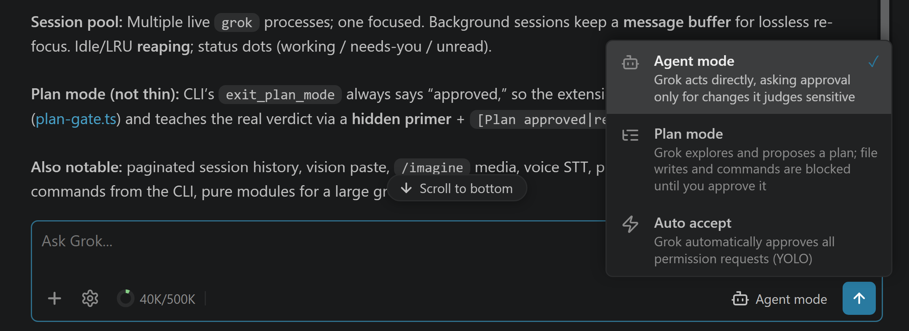

</details>

<details>
<summary><strong>Image & video generation</strong> — <code>/imagine</code> renders right in the chat</summary>

Type `/imagine <prompt>` (or `/imagine-video <prompt>`) and the result renders **inline** — images as thumbnails, videos with playback controls, **Copy path** / **Open in VS Code** on hover. Editing a reference photo works too. Both are subscription-only Grok features, and both survive a session resume.

</details>

<details>
<summary><strong>Paste or attach images</strong> — Grok sees the pixels, not just a path</summary>

**Ctrl+V a screenshot**, drag-drop an image, or attach one with the **+** picker (png/jpg/gif/webp, up to 20 MiB) — it's sent as vision input, so you can ask *"what's wrong with this UI?"* about a dialog you just captured. Disk imports keep their file path so Grok can also act on the real file, and chips restore when you reopen the session.

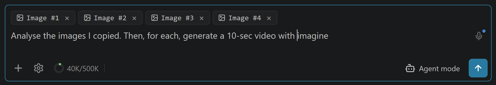

</details>

<details>
<summary><strong>Voice control</strong> — hands-free dictation with live transcription</summary>

The **microphone button** dictates speech through [xAI's](https://docs.x.ai/developers/model-capabilities/audio/speech-to-text) or OpenAI's speech-to-text — words appear live as you talk. Say **"grok send"** to submit hands-free and keep dictating; messages spoken while Grok responds queue and flush when it finishes.

Use your existing Grok sign-in or an OpenAI API key. Auto prefers OpenAI for Codex and xAI for Grok/Claude, with credential-based fallback. Local recording requires [`ffmpeg`](https://ffmpeg.org). Setup, devices, and costs: **[docs/voice-setup.md](docs/voice-setup.md)**.

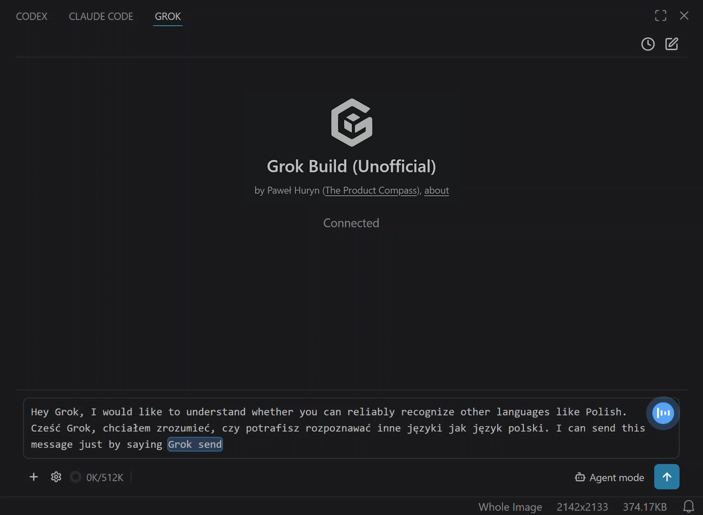

</details>

<details>
<summary><strong>File chips</strong> — your editor and selection as <code>@file</code> context</summary>

The active editor rides along automatically; add more by **typing `@` in the composer** (a workspace file picker opens — arrow keys + Enter, fuzzy-matched), dragging from the Explorer, right-click → **Add to Grok chat** (one file or a whole selection), **Alt+G**, or the **+** button. Chips send as `@/path` references, so content stays current and history stays small. **Shift-drag from outside the editor** embeds the file inline instead; dragging out of VS Code's own Explorer needs Shift held mid-drag (press it after the drag starts — Shift+click there selects a range) just to reach the panel at all, so those always attach as chips.

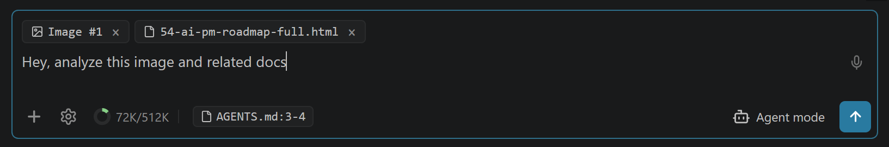

</details>

<details>
<summary><strong>Session history</strong> — parallel sessions with status dots; resume, rename, search & clear</summary>

The clock icon lists this project's sessions, newest first. Click a row to resume — images, plans, and reasoning intact — or hover to rename or delete it. The **search box** filters your whole history, older sessions load as you scroll, and **Clear all history** sweeps everything but the current session.

Sessions run in **parallel**: start a new one with **+** while another is mid-turn and switch between them from this list — the one you leave keeps working in the background, and switching back is instant, with no reload. Each row's **status dot** tells you what it's doing:

| Dot | Meaning |
|---|---|
| 🔵 Blue | Working |
| 🟡 Yellow | Needs you — a permission, question, or plan is waiting |
| 🟢 Green | Finished, with results you haven't opened yet |
| 🔴 Red | Finished with an error you haven't opened |
| ⚪ Gray | At rest |

The green/red dot is an **unread badge** — it survives a VS Code restart and clears when you open the session, so after firing off a few agents the green dots are exactly the results waiting for you.


</details>

<details>
<summary><strong>Queue or steer</strong> — type while the agent works, without ever interrupting it</summary>

A message you send mid-turn **never cancels** anything. By default it **queues** — a pending block at the end of the chat (Edit / Remove), sent the moment the turn ends; type more and it merges into the same message. Hit **Steer** on it to redirect the agent *now* instead: the text goes straight into the running turn without losing the tool work in flight. Prefer that always? Turn on **Steer by default** (Settings).

**Grok** and **OpenAI Codex** both take a mid-turn correction; **Claude Code** does not, so there the Steer button never appears and anything you send while it works simply queues. A steer carries your text and the files you attached to that message — images included, where that agent accepts them; where it doesn't, the whole message is queued rather than sent without its pixels, and the chat tells you so. What it leaves out is the ambient editor selection: the running turn already has the version it started with.

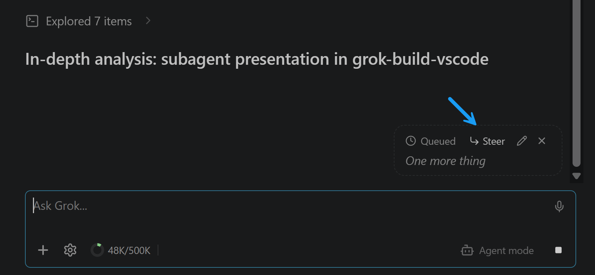

</details>

<details>
<summary><strong>Fork conversation</strong> — branch a thread without touching the original</summary>

The conversation's ⋯ menu → *Continue in a new chat* → **Use this workspace** copies the conversation into a **new session** named `(Fork) <the original's name>` and opens it — try a tangent or a different approach while the original stays **byte-for-byte unchanged** in your history. It branches the conversation, not your code: files on disk are untouched.

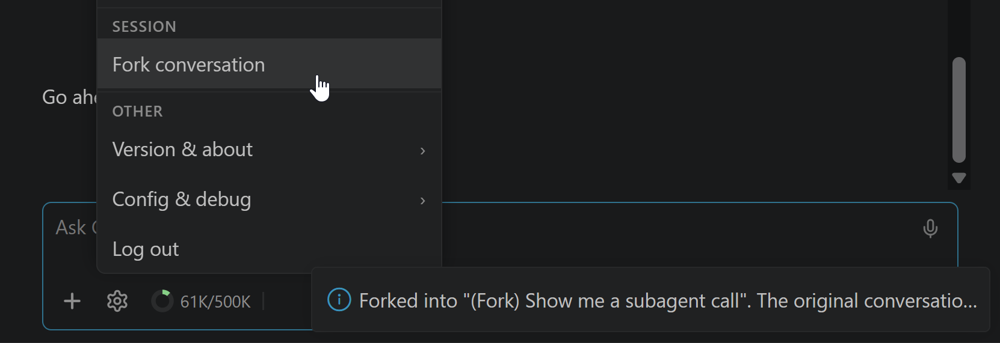

</details>

<details>
<summary><strong>Worktree session</strong> — isolate code edits in a git worktree</summary>

**Grok: New Worktree Session** (the conversation's ⋯ menu → *Continue in a new chat* → **Use a new worktree**, or the Command Palette) creates an isolated git worktree under `~/.grok/worktrees/` and opens a fresh session whose cwd is that checkout — so agent edits don't touch your main tree until you **Apply worktree**. **Remove worktree** deletes the isolated checkout. History rows for worktree sessions show a `WT <label>` badge and reopen with the correct cwd.

</details>

<details>
<summary><strong>Changes</strong> — is my work safe to walk away from, answered in the panel</summary>

The project panel's branch button carries a badge of uncommitted files and opens a **Changes** view. One sentence answers the question you actually have — conflicts, then uncommitted work, then unpushed commits, then clean — and one button carries the whole promise (**Commit and push**, **Push 3 commits**), so nothing repeats it back at you in a dialog. **Commit** sits beside it for work you want recorded but not published yet. A refused push says what to do next — connect GitHub, or ask the agent to pull — and **Ask agent to pull** on the branch line drops that request into the message box for you. It is every changed file or none — to leave something out, discard it, and the view says so under the buttons rather than leaving you to find out. A very large tree lists the first 200 rows and says how many more there are; the count above them and the commit itself still cover every one. The turn's **Changed N files** card carries an **Open Changes** link, so the answer to "and what is uncommitted now?" is one tap from the answer to "what did this turn touch?". Files open into the same diff the chat renders under a tool call; discarding one is reachable only from inside its diff, because an irreversible action should require having looked. Unpushed commits are listed only when nothing is uncommitted — two lists of unfinished work at once is the noise this view exists to remove. It never runs `git fetch`, so *behind* is reported as of your last one and the line says so. Coding purpose only, and it reads and works the same from a phone — where it also refreshes itself while you are looking at it, and stops when you switch away.

</details>

<details>
<summary><strong>Rewind</strong> — roll the conversation (and files) back to an earlier point</summary>

Hover a message you sent → **Rewind** (or **Grok: Rewind Conversation**), confirm, and Grok rolls back to that point — truncating the chat and, optionally, restoring the files it changed since then from its own snapshots. A safety prompt shows first, because rewinding can revert code on disk. Both work from a browser as well as at the desk.

</details>

<details>
<summary><strong>Deep Research / Workflow progress</strong> — a live progress card with Pause / Resume / Stop</summary>

When Grok runs a Deep Research, Workflow, or Goal task, a progress card streams its steps live and gives you **Pause**, **Resume**, and **Stop** controls, so long autonomous runs stay visible and interruptible.

</details>

<details>
<summary><strong>Context & cost</strong> — what's in the window, and what the turns actually bill</summary>

Click the **context donut** for `used / window (%)` — said in thousands, with the exact count still on the donut's own tooltip — plus what the conversation has **billed** — input, cache read, output, and the CLI-reported **USD cost** — as a session total and a per-turn split with its model calls. **Compact conversation** lives here too, right next to the number that tells you when you need it. The same popover answers the other usage question — **how much of your plan's window is left**, as labelled windows with a meter, a reset time, and when the reading was taken. Grok asks the account, Codex reads what Codex itself records, and Claude's arrives with your next reply.

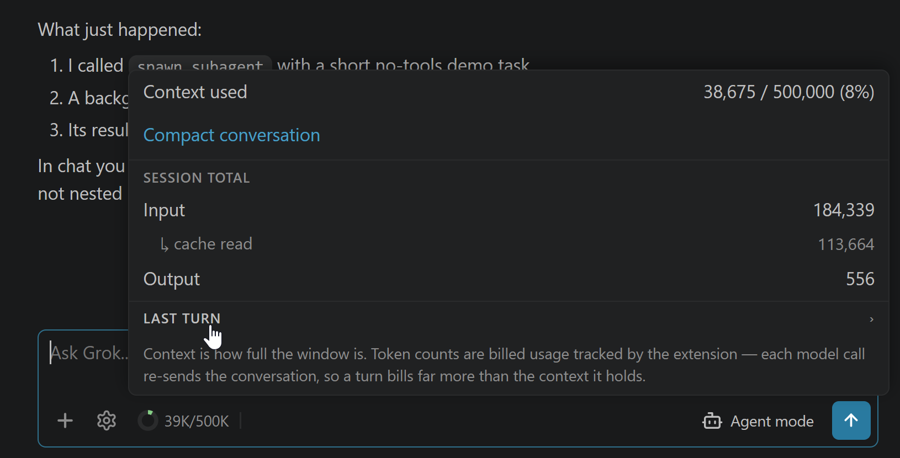

</details>

<details>
<summary><strong>Subagents</strong> — delegated tasks render as cards with their result</summary>

When Grok delegates work to a subagent, the chat shows a card with the task and a live timer, then the subagent's output when it finishes — background subagents included, whose result folds back into the card when it lands.

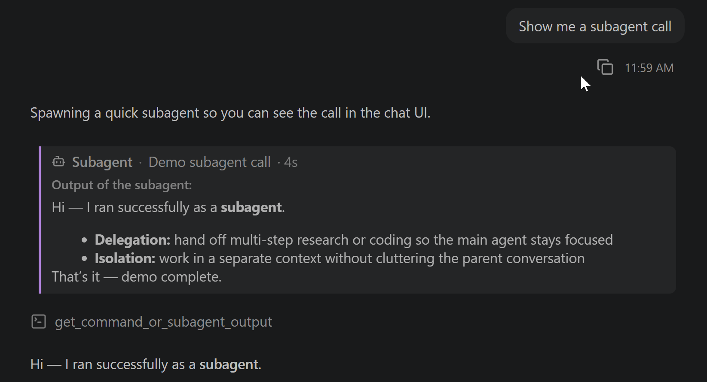

</details>

<details>
<summary><strong>Tool calls</strong> — every read, edit & command inline; expand for full details</summary>

Every action appears as a category-iconed row, batched and summarized ("Explored 5 items", "Edited 2 files"); a failed tool turns red with the reason. Edits show a `+N −M` change count and expand to an inline diff at the file's real line numbers; shell commands expand to an **IN/OUT block** with the full command and its complete output — exactly what Grok received, exit code included. In Coding purpose, a turn that changed files ends with a **Changed N files** card rolling up every path and its `+N −M`; tap a row for **one diff covering everything the turn did to that file** — taken against what the file looked like before the agent touched it, not before its last edit — and on a desk **open diff** puts that in its own editor tab. Where a diff cannot be taken honestly (a folder that is not a git repository, a repository busy with another command, a project you switched away from between sending and tapping) the row falls back to the tool call that made the edit; a turn from a conversation you have reloaded says so at the foot of the card instead, because the before-state is kept only while the session stays open. The card starts collapsed; click its header to reveal the file list and, where available, the Open Changes button. **Expand diff card** (`grok.expandDiffCard`) sets its own default independently of tool details, and applies live to existing cards. On a phone or browser the choice is stored on that device. To audit an Auto-accept run, pre-expand everything with `grok.expandCommandOutputs`, or **Grok: Expand All Tool Details** from the Command Palette.

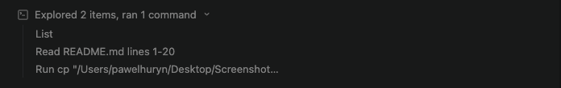

</details>

<details>
<summary><strong>Math &amp; LaTeX rendering</strong> — equations render as math, not raw TeX</summary>

LaTeX in answers — inline `\(…\)`, display `\[…\]`, matrices, integrals, Greek — renders as real typeset math via [MathJax](https://www.mathjax.org), bundled so it works **offline**. Hover a display equation to copy its source or export it as PNG or SVG. (Bare `$…$` is deliberately not a delimiter — it would mangle "it costs $5".)


</details>

<details>
<summary><strong>Mermaid diagrams</strong> — flowcharts and sequence diagrams render as diagrams</summary>

A ` ```mermaid ` block renders as a real diagram via [Mermaid](https://mermaid.js.org) — bundled, offline, themed to your light/dark mode. Hover to copy the source or export it as PNG or SVG; while it's still streaming, or if it's malformed, the readable source is shown instead.


</details>

<details>
<summary><strong>Model picker</strong> — switch models live, no restart</summary>

Click the model chip in the composer to open the model picker. The list comes from your CLI; switching is live in most cases. (A few models belong to a different agent and need a quick restart — the extension detects that and carries your context forward.)

</details>

<details>
<summary><strong>Multi-provider</strong> — built for Grok Build, works with other ACP agents</summary>

The host talks **ACP** (JSON-RPC over stdio), not a Grok-specific protocol, so the same UI drives any agent that speaks it — **OpenAI Codex** and **Claude Code** included. Connect them in **Settings → Providers**; each signs in through its own CLI. Grok Build is the default and the one everything is tuned against, but every connected agent shares one model picker, and each conversation keeps the agent it started with, so all three can run side by side with the same chat, diffs, permission cards, and history. Providers also offers to **update each CLI in place** when yours is older than the version this app is built against — installed the way you installed it (npm, Homebrew, or the vendor's own installer), never switching you to a different one — and the conversations you had open reopen when it finishes.

**Settings → Connectors** has three sections: apps you connect here (Connect / Disconnect — available to Grok, Codex, and Claude), grok.com connectors that follow your Grok account, and local Grok connectors declared in this machine's config files. Connecting an app is not desk-only: it works from a phone, and on a cloud machine where there is no desk at all. Project-file servers stay off this page. grok.com connectors are edited at [grok.com/connectors](https://grok.com/connectors).

Settings → Providers → **Provider config files** opens the file each CLI actually reads — `~/.grok/config.toml`, `~/.codex/config.toml`, `~/.claude/settings.json` — and edits it in place, from a phone as readily as at the desk. Those three are the whole list: the credentials that live beside them are not reachable from here. A CLI reads its config once at startup, so the panel offers to **restart the conversation you have open** after you save, and states the limit rather than hiding it — other sessions already running keep the settings they started with.

</details>

<details>
<summary><strong>Reasoning effort</strong> — trade tokens for depth</summary>

Click the composer model chip, then choose a stop on the effort strip. The available levels follow the selected model. On recent CLIs it applies **live** to the running session; older ones restart, with an optional *Summarize & Restart* that carries context forward.

</details>

<details>
<summary><strong>Remote Control (AFK Pilot)</strong> — watch and steer your sessions from a phone or any browser</summary>

**Sign in (link this device)** under Remote control in the VS Code **+** menu (or the Desktop rail gear) pairs this machine with **[AFK Pilot](https://afkpilot.com)**, a companion web client that mirrors this chat in the browser: follow a running turn, approve permissions, answer questions, and send or steer messages from your phone while away from your desk. **Connecting an agent** works from there too — the CLI's headless sign-in runs on the linked computer and the page shows you the link (and, for Grok and Codex, the short code) to confirm, from the onboarding card or from Settings → Providers. So does **connecting an app** under Settings → Connectors: its sign-in runs on the linked computer too, and the browser lands back on the page instead of a localhost address you would have to copy across. **Grok**, **OpenAI Codex**, and **Claude Code** all sign in this way. Codex needs device-code login enabled on your OpenAI account first, and the flow walks you through it. Claude Code is paste-code: you open the link, sign in, and paste the code Anthropic shows you back into the page. The extension dials **out** to the service — no inbound port, no port forwarding — and **Sign out** unlinks the device again. The mobile view renders the retained chat window in full fidelity (diffs, images, equations, diagrams) with touch-sized controls; on reconnect, the remote snapshot is capped at the last 10 user messages while the VS Code view keeps the complete buffer. Its own **+** picker attaches a photo or a document (`.md`/`.txt`/`.pdf`/`.csv`/`.xlsx`/`.docx`) straight from your phone. You can **dictate** there too — say *"grok send"* to submit hands-free — **rewind or edit a message** you already sent, **connect GitHub** — from Settings or while cloning — and pick a private repository from a list rather than typing its URL, give each browser tab its **own conversation and repository**, and pick up the very conversation VS Code has open, live in both. A conversation follows the tab you are using: asking for it from a second tab moves it there and tells the first, which can take it back with one tap.

A **projects rail** lists every repository with Grok history and its newest conversations, with pinned conversations lifted above them across all projects and a search over both. You can start a session in any project without switching to it first, and rename, delete or clear history from the row — from the ⋯ button or by right-clicking it. Give a project a **colour** and an **icon** and it carries them everywhere it is named — its row in the rail, the chip above the message box, the project switcher, the file panel — on VS Code, desktop, cloud, or your phone. Projects you put away — and any left untouched for 30 days — fold into **Archived**, and come back on their own the moment you work in one again. Expand Archive to open a conversation or move a project back to Projects on VS Code, desktop, cloud, or your phone. Archiving keeps every project reachable. On a phone the rail is a drawer behind the handle in the header.

While a device is linked, the extension also **keeps the machine awake** (`caffeinate` on macOS, `SetThreadExecutionState` on Windows, `systemd-inhibit` on Linux) so a turn you kicked off from your phone isn't cut short by idle sleep. The display still sleeps — only system sleep is blocked — and the lock is released the moment you sign out. Turn it off with `grok.remote.keepAwake`. A **closed laptop lid still suspends** on every OS; no application can override that.

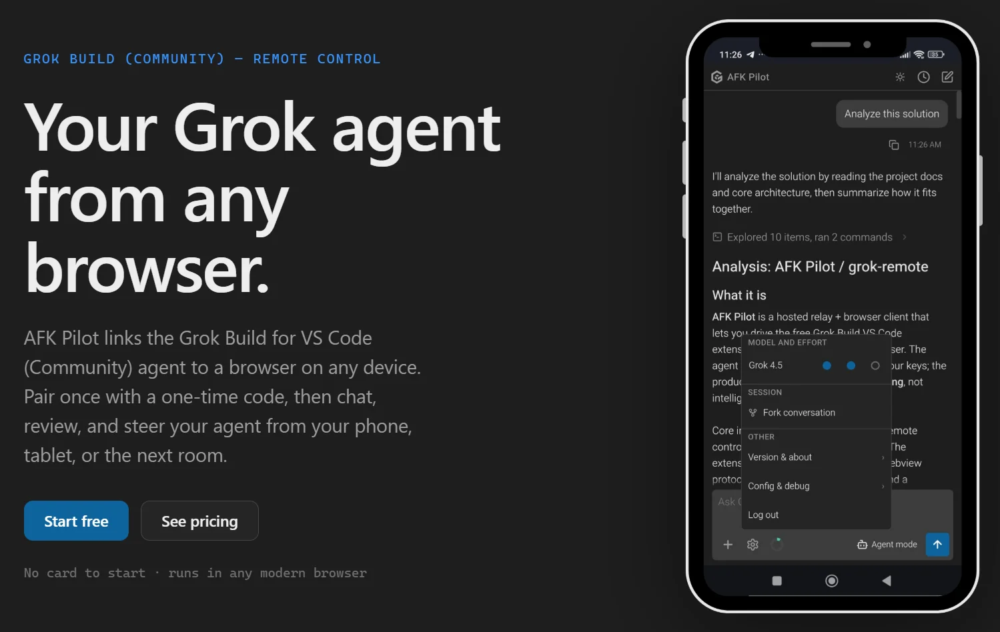

</details>

---

## Requirements

- **VS Code** 1.106+ (or a compatible editor on the same base — Cursor 3.x qualifies; Antigravity is still on base 1.104 and keeps the last compatible extension version).
- **The Grok Build CLI** (`grok`) on macOS, Linux, or Windows. The CLI ships a native Windows build, so the extension runs natively on all three — no WSL required (WSL2 + Remote-WSL still works if you prefer it).
- **A login:** either a **SuperGrok or X Premium+** subscription (`grok login`) or an xAI API key. Either subscription unlocks **Grok Build**; with an API key you also get the **grok-4.x** models and **grok-imagine**. (Grok's free tier does **not** include the CLI agent.)
- **Voice control** is optional and uses Grok sign-in or an OpenAI API key (Codex sign-in alone does not include transcription) — it just needs [`ffmpeg`](https://ffmpeg.org) to record. Setup + advanced options: [docs/voice-setup.md](docs/voice-setup.md).

---

## Install

### VS Code / Cursor extension

**1. Install the extension.** In VS Code or Cursor, open **Extensions** (`Ctrl/Cmd+Shift+X`) and search **"Grok Build for VS Code (Community)"** — or install from the [VS Code Marketplace](https://marketplace.visualstudio.com/items?itemName=PawelHuryn.grok-vscode-phuryn) / [Open VSX Registry](https://open-vsx.org/extension/PawelHuryn/grok-vscode-phuryn).

**2. Open Grok and sign in.** Press `Ctrl/Cmd+;`. The sidebar **walks you through installing the `grok` CLI and signing in** — one click per step, with your SuperGrok / X Premium+ subscription or an xAI API key. That's the whole setup.

Grok opens in the **Secondary Side Bar** (right side, next to other AI tools). Prefer it elsewhere? Settings → **Move view** relocates it to the Panel or Primary Side Bar in one click.

> Prefer the terminal, building from source, or installing into several IDEs at once? See **[docs/INSTALL.md](docs/INSTALL.md)**.

### Grok Build Desktop

Standalone app for **macOS** (Apple Silicon + Intel), **Windows** (x64) and **Linux** (x86_64 AppImage). Same agent UI as the extension; no VS Code required.

**1. Download** the installer from **[afkpilot.com/desktop](https://afkpilot.com/desktop)** — it detects your platform and offers the right build. Asset names:

| Platform | File |
|---|---|
| macOS Apple Silicon | `Grok-Build-Desktop-<version>-mac-arm64.dmg` |
| macOS Intel | `Grok-Build-Desktop-<version>-mac-x64.dmg` |
| Windows x64 | `Grok-Build-Desktop-<version>-win-x64.exe` |
| Linux x86_64 | `Grok-Build-Desktop-<version>-linux-x86_64.AppImage` |

(Zip archives are also published for macOS: `…-mac-arm64.zip` / `…-mac-x64.zip`.)

**2. Install and open** the app, then pick a project folder (File → Add Project Folder). Onboarding installs the `grok` CLI and signs you in the same way as the extension.

**macOS is signed and notarised** (since 3.2.7) — the app opens straight from the `.dmg`, with no Gatekeeper warning and nothing to allow through in Settings.

**Windows is not signed yet**, so Microsoft Defender SmartScreen may show “Windows protected your PC.” Choose **More info** → **Run anyway**.

**Linux ships as a single AppImage** — nothing to install. `chmod +x` it and run it; it needs FUSE (`libfuse2` on Debian and Ubuntu). It updates itself in place from then on.

Details, build-from-source, and signing notes: **[docs/desktop.md](docs/desktop.md)**.

---

## Quick start

Open **Settings** from **+** in VS Code or the rail gear in Desktop and AFK Pilot.

1. **Open** Grok — in VS Code: `Ctrl/Cmd+;` (Secondary Side Bar by default); in Desktop: launch the app and add a project folder.
2. **Type a prompt** and press **Enter**. Grok streams its answer, showing a *Thinking…* line while it reasons. Want the full reasoning inline? Turn on **Show thinking traces** in Settings.
3. **Approve actions.** When Grok wants to write a file or run a command it may raise a permission card — preview an edit (native diff in VS Code; in-app viewer on Desktop), then *Allow once / always / Reject*.
4. **Pick your mode** (Agent / Plan / Auto accept), **model**, and **reasoning effort** from the bottom toolbar and model chip.
5. **Resume anytime** — the clock icon lists past sessions for this project.

---

## Configuration

<details>
<summary><strong>All <code>grok.*</code> settings</strong> (VS Code Settings → search "grok")</summary>

| Setting | Default | Notes |
|---|---|---|
| `grok.cliPath` | `""` | Path to the `grok` binary. Empty = auto-discover (`~/.grok/bin/grok` → PATH). |
| `grok.defaultModel` | `""` | Model ID for new sessions. Empty = CLI default. |
| `grok.defaultEffort` | `""` | Reasoning effort forwarded as `--reasoning-effort` (`none` / `minimal` / `low` / `medium` / `high` / `xhigh`). Empty = CLI default. Applies live on recent CLIs; older CLIs (and resetting to the model default) restart the session. |
| `grok.defaultMode` | `""` | Mode for new sessions, remembered automatically from your last Agent / Auto accept switch (Plan is never remembered). Empty = Agent. |
| `grok.includeActiveFileByDefault` | `true` | Auto-add the active editor as a context chip. Sends the file **path** (not its contents) unless you have text selected, in which case the selected lines are included. Click the chip to toggle it off — that choice is remembered across file switches and restarts. |
| `grok.mentionIndexLimit` | `5000` | How many workspace files the composer's **@** autocomplete indexes. Raise it (no upper limit) if files are missing from the `@` list in a large repo; applies on the next `@`. Files you have open as tabs are always mentionable regardless of this cap. |
| `grok.acp.promptIdleTimeoutMs` | `1800000` | Silence before a live turn is treated as hung (`ACP request timed out: session/prompt`). Any ACP traffic resets the idle clock. `0` disables. Applies to new sessions. |
| `grok.acp.promptAbsoluteTimeoutMs` | `86400000` | Hard wall-clock cap for one turn, even while it is still streaming. `0` disables. Applies to new sessions. |
| `grok.acp.requestTimeoutMs` | `120000` | Timeout for ACP methods other than `session/prompt` (`initialize`, `session/new`, …). |
| `grok.useCtrlEnterToSend` | `false` | When true, Enter inserts a newline and Ctrl/Cmd+Enter sends. |
| `grok.showThinking` | `false` | Show Grok's reasoning (thinking) traces in chat. Off shows a *Thinking…* stand-in. Also toggleable live from Settings. |
| `grok.expandCommandOutputs` | `false` | Expand tool details by default — each shell command's IN/OUT block and each edit's inline diff (useful for auditing Auto-accept sessions). With this setting on, groups containing command or edit details open too; read/explore-only groups stay collapsed, and a lone command outside a group opens its details. Edit rows always show a `+N −M` change count, even when their diff is closed. Toggle live from Settings → **Expand tool details**. (Setting key kept for compatibility.) |
| `grok.expandDiffCard` | `false` | Open each coding turn's Changed-files card by default. Click a header to toggle that card; changing this preference updates all existing cards. Independent of Expand tool details and Expand/Collapse All. Host-backed on desktop and IDEs; stored per device on a phone or browser. |
| `grok.steerByDefault` | `false` | Send straight into the running turn instead of queueing. Off: a message sent mid-turn waits and flushes when the turn ends (steer it on demand with the **Steer** button). On: it skips the queue and redirects the agent immediately. Applies wherever that agent takes a mid-turn correction — **Grok** and **OpenAI Codex** do, **Claude Code** does not and keeps queueing. Never cancels the turn or discards work in progress; carries your text and its attachments, not the ambient editor selection. Toggle live from Settings → **Steer by default**. |
| `grok.soundNotifications` | `false` | Play a short tone when Grok finishes a turn or errors — a rising chime for done, a lower tone for errors — but **only when the Grok panel isn't focused**, so it notifies you when you've stepped away. Toggle live from Settings → **Sound notifications**. |
| `grok.thumbsFeedback` | `false` | Show thumbs on a finished Grok turn so you can send a rating to SpaceXAI. Off by default. On, thumbs appear only when this Grok session supports feedback — never on Codex or Claude. Toggle from Settings → General → **Thumbs feedback to SpaceXAI**. |
| `grok.telemetry.enabled` | `true` | Send anonymous, privacy-first usage telemetry (see [Privacy](#privacy)). Also honors VS Code's global `telemetry.telemetryLevel`. |
| `grok.chatFontScale` | `100` | Zoom for the chat panel only, as a percent (`150`, `200`, …). Scales the whole chat UI without rescaling the rest of VS Code (unlike `Ctrl/Cmd+Shift+=`). Applies live; supports User (global) and Workspace (local) scope. |
| `grok.voiceBackend` | `"auto"` | Prefer the agent vendor when its credential is available, otherwise use the other. Explicit `xai` / `openai` choices require that credential. |
| `grok.voiceOpenAiApiKey` | `""` | OpenAI API-platform key override; empty uses `OPENAI_API_KEY`. Codex / ChatGPT sign-in does not include transcription API access. |
| `grok.voiceOpenAiModel` | `"gpt-live-transcribe"` | OpenAI Realtime transcription model. |
| `grok.voiceApiKey` | `""` | Optional xAI key override. Empty = `GROK_VOICE_API_KEY` / `XAI_API_KEY` from `.env` or the host environment, then your cached `grok login` token. See [docs/voice-setup.md](docs/voice-setup.md). |
| `grok.ffmpegPath` | `""` | Path to `ffmpeg` for microphone recording. Empty = use `ffmpeg` from `PATH`. |
| `grok.voiceInputDevice` | `""` | Microphone device override. Empty = system default (Windows auto-detects the first DirectShow audio device). |
| `grok.voiceSendPhrase` | `"grok send"` | Spoken phrase that auto-submits when it ends a transcription. Empty = disable hands-free sending. |
| `grok.voiceKeyterms` | `[]` | Words or phrases that bias streaming recognition toward code and project vocabulary. Sent to the selected backend with each streaming connection; up to 100 terms of 50 characters, including the send phrase and `Grok`. |
| `grok.voiceLanguage` | `""` | Optional language code (for example `en`, `fr`, `de`, or `ja`). Controls xAI text formatting and supplies an OpenAI transcription language hint. |
| `grok.voiceStreaming` | `true` | Stream transcription live as you speak. `false` = one-shot batch mode. Costs depend on backend and model; OpenAI API usage is billed separately. |

</details>

---

## Commands & keybindings

<details>
<summary><strong>VS Code commands & keys</strong> (Ctrl/Cmd+Shift+P → "Grok")</summary>

VS Code commands (not Grok slash commands):

| Command | What it does |
|---|---|
| `Grok: Open` | Open the Grok sidebar |
| `Grok: New Session` | Start a fresh session |
| `Grok: Compact Conversation` | Compact the current session to reclaim context |
| `Grok: Pick Model` | Open the model picker |
| `Grok: Toggle Plan / Agent Mode` | Open the mode picker (Agent / Plan / Auto accept) |
| `Add to Grok chat` | Add files to the composer (the Explorer selection, the active editor, or a file picker) |
| `Add Selection to Grok` | Attach the selected lines as a snippet chip in the composer |
| `Grok: Insert @-Mention` | Insert an `@`-mention for the active file into the composer |
| `Grok: Expand All Tool Details (This Session)` | Open every tool group, command IN/OUT box, and edit inline diff, and keep new ones open — this session only |
| `Grok: Collapse All Tool Details (This Session)` | Collapse them all, and keep new ones collapsed — this session only |
| `Grok: Show Logs` | Open the Grok output channel (ACP messages, errors) |
| `Grok: Log Out` | Sign out of the Grok CLI (`grok logout`) and return to the sign-in screen |

| Key | Action |
|---|---|
| `Ctrl+;` / `Cmd+;` | Open Grok sidebar |
| `Alt+G` | Insert `@`-mention for the active file (when the editor is focused) |

Grok's own **slash commands** (`/imagine`, `/compact`, …) autocomplete in the composer when you type `/`, sourced live from your installed CLI version. Reference snapshot: [docs/SLASH-COMMANDS.md](docs/SLASH-COMMANDS.md).

</details>

---

## How it works

The extension is intentionally **thin**: it speaks JSON-RPC over `grok agent stdio` and renders the results. Grok owns sessions, memory, MCP, models, and tool execution; the extension mediates file reads/writes, terminal requests, diff previews, the webview UI — and **Plan Mode**.

Plan Mode is the one place the extension adds defense-in-depth. The CLI owns the plan review and receives native JSON-RPC success outcomes (`approved`, `cancelled` for Keep planning, or `abandoned` for Cancel), so approval or revision continues inside the original turn. An Approve/Keep-planning comment is interjected before that verdict releases the turn; a Cancel comment queues as the next ordinary prompt because abandonment has no continuation step. The extension's **gate** still blocks workspace writes and non-read-only commands while planning because the CLI's own terminal path remains porous. No hidden primer, bracket marker, follow-up verdict prompt, or verdict-time turn cancellation is sent. Plan is disabled fail-closed when the CLI is older than the required version or its version cannot be verified.

Full diagram, message flow, module map, and design notes: **[docs/architecture.md](docs/architecture.md)**.

---

## Development

Building, testing and repo conventions live in **[docs/development.md](docs/development.md)**.

The rest of the documentation is indexed in **[docs/](docs/README.md)**.
Contributions are welcome.

---

## Known limits

- **Diff preview semantics.** The native editor reconstructs both full-file sides from Grok's replaced-region metadata and the current file on disk, then opens on the first changed line. If the file is unreadable, oversized, or has moved on so the region cannot be located, it safely falls back to the region-only diff. The write happens only after approval.
- **View placement.** The view defaults to the **Secondary Side Bar** (requires VS Code 1.106+, the extension's engine floor). Relocate it anytime via Settings → **Move view** (one click: Panel / Primary Side Bar / Secondary Side Bar) — useful in Cursor, whose side-bar context menu hides the built-in "Move To" entry.

---

## Privacy

**Privacy by design** — no message content, code, or file paths leave your machine automatically. The only automatic report is an anonymous, opt-out `session_start` (turn it off with `grok.telemetry.enabled: false` or VS Code's global `telemetry.telemetryLevel`). It carries an install id plus a low-cardinality settings snapshot, including mode / model / effort, host kind, UI preferences, whether voice input is available, and which agents are connected — **never** message content, code, paths, or free-text settings. The full field list is in [docs/privacy.md](docs/privacy.md). Data leaves only through features you explicitly enable or invoke: Voice input sends audio to the selected xAI or OpenAI backend for transcription; the optional **Read simplified summaries** switch in VS Code or AFK Pilot sends the cleaned spoken reply to SpaceXAI for a brief version; optional **Thumbs feedback to SpaceXAI** (off by default) sends a rating on a finished Grok turn; Remote Control relays the chat to your linked devices. Each is disclosed separately from telemetry.

More: [docs/privacy.md](docs/privacy.md).

---

## License & attribution

Licensed under the **Functional Source License, Version 1.1, MIT Future License (FSL-1.1-MIT)** — see [LICENSE](LICENSE). In short: use, modify, and redistribute freely for any purpose **except** offering a competing commercial product or service. Versions up to and including 1.8.1 were published under MIT and remain MIT. The copyright notice and license text must travel with all copies, including compiled builds — if you're reusing this project, see [docs/attribution.md](docs/attribution.md) for how to credit it properly.
